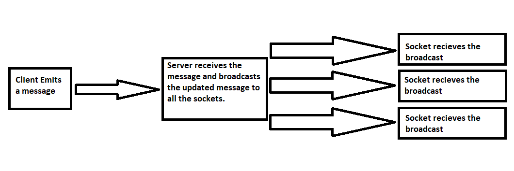

# How to stop form from not refreshing the page on submit?
One great way to prevent reloading the page when submitting using a form is by adding return false with your onsubmit attribute.

# socket.emit and io.sockets.emit
socket.emit is used to message to sender-client only
io.sockets.emit is used to broadcast the message to all the clients connected to the server.

# array.filter()
This function filters out all the elements that pass the test implemented by the provided function.

Ex: Fetch all even numbers from [1, 2, 3, 4, 5, 6, 7, 8]
```
let even_numbers = [1, 2, 3, 4, 5, 6, 7, 8].filter(function(num) {
    return num%2 == 0;
})
```

# array.map()
This function is used to process array elements using the callback of map. Returned array is of the same length of original array.

Ex: map usage

```
let squared_numbers = [1, 2, 3, 4, 5].map(function(value, key, item) {
    return value*value;
});
```

# Call chain (how update message or new message is delivered to all sockets)

- a socket emits a message (new or update) from client.
- it's received and server broadcasts the updated message(upon new or update reception) to all the sockets.
- message is received on the client side by all the sockets (browsers) where render is called and UI of every socket browser is updated with latest values.



